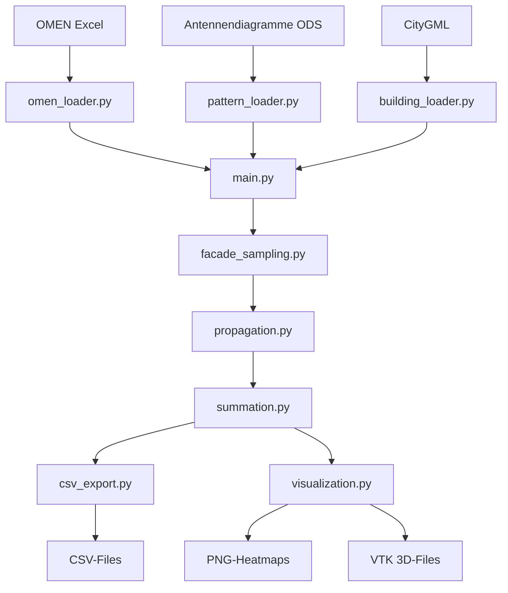

# EMF-Hotspot-Finder - Dateiübersicht

Schnellreferenz aller Dateien im Projekt und ihre Zwecke.

## Dokumentation

| Datei | Zweck | Zielgruppe |
|-------|-------|------------|
| **README.md** | Projekt-Übersicht und Schnellstart | Alle User |
| **BENUTZERHANDBUCH.md** | Vollständige Dokumentation mit Fish-Shell-Befehlen | Alle User |
| **DATEI_UEBERSICHT.md** | Diese Datei - Schnellreferenz aller Dateien | Alle User |
| **SETUP_ENVIRONMENT.md** | Detaillierte venv-Setup-Anleitung | Setup/Troubleshooting |
| **TODO_VIRTUELLE_GEBAEUDE.md** | Geplantes Feature: Virtuelle Gebäude auf leeren Parzellen | Entwicklung |

---

## Setup-Skripte

| Datei | Zweck | Shell | Ausführung |
|-------|-------|-------|------------|
| **setup_venv.sh** | Automatisches venv-Setup | Bash/Zsh | `bash setup_venv.sh` |
| **setup_venv.fish** | Automatisches venv-Setup | Fish | `fish setup_venv.fish` |
| **check_environment.py** | Prüft Python-Umgebung und Packages | Alle | `python3 check_environment.py` |
| **requirements.txt** | Python-Dependencies | - | Wird von Setup-Skripten verwendet |

---

## Analyse-Programm

| Datei/Verzeichnis | Zweck |
|-------------------|-------|
| **emf_hotspot/** | Hauptmodul (Python-Package) |
| **emf_hotspot/main.py** | CLI-Einstiegspunkt - hier startet alles |
| **emf_hotspot/config.py** | Konstanten (AGW=5V/m, Auflösung, etc.) |
| **emf_hotspot/models.py** | Datenklassen (Antenna, Building, HotspotResult) |

### Loaders (Datenimport)

| Datei | Zweck |
|-------|-------|
| **emf_hotspot/loaders/omen_loader.py** | Parst OMEN-Excel-Sheets (Antennendaten, OMEN O1-O20) |
| **emf_hotspot/loaders/pattern_loader.py** | Lädt Antennendiagramme (ODS oder Standard-Patterns) |
| **emf_hotspot/loaders/building_loader.py** | Parst CityGML (swissBUILDINGS3D) |
| **emf_hotspot/loaders/geoadmin_api.py** | WMS-Basiskarten, Gebäudeadressen von geo.admin.ch |

### Geometry (Geometrische Berechnungen)

| Datei | Zweck |
|-------|-------|
| **emf_hotspot/geometry/coordinates.py** | LV95-Koordinaten (Parsing, Umrechnung) |
| **emf_hotspot/geometry/angles.py** | Azimut/Elevation relativ zur Antenne |
| **emf_hotspot/geometry/facade_sampling.py** | Fassaden-Rasterung (Punkte auf Gebäudeflächen) |

### Physics (Physikalische Berechnungen)

| Datei | Zweck |
|-------|-------|
| **emf_hotspot/physics/propagation.py** | E-Feld-Formel (Freiraumdämpfung) |
| **emf_hotspot/physics/pattern.py** | Antennendiagramm-Interpolation |
| **emf_hotspot/physics/summation.py** | Leistungsaddition über alle Antennen |

### Output (Export und Visualisierung)

| Datei | Zweck |
|-------|-------|
| **emf_hotspot/output/csv_export.py** | Exportiert CSV-Dateien |
| **emf_hotspot/output/visualization.py** | 2D-Heatmaps, 3D-VTK-Export |
| **emf_hotspot/output/paraview_state.py** | ParaView State Files (.pvsm) |

---

## Eingabedaten (input/)

| Datei | Format | Inhalt |
|-------|--------|--------|
| **OMEN R37 clean.xls** | Excel | Antennendaten, Standort, OMEN O1-O20 |
| **Antennendämpfungen Hybrid AIR3268 R5.ods** | ODS | Antennendiagramme (H/V je Frequenz) - optional |

---

## Gebäudedaten (gebaeude_citygml/)

| Dateiformat | Quelle | Inhalt |
|-------------|--------|--------|
| **\*.gml** | swissBUILDINGS3D 3.0 | 3D-Gebäudegeometrie (LOD2), Fassaden, EGID |

Große Dateien (100MB-800MB), daher lokal gespeichert statt git.

---

## Ausgabedaten (output/)

### CSV-Dateien

| Datei | Inhalt | Größe |
|-------|--------|-------|
| **hotspots.csv** | Alle Einzelpunkte >5.0 V/m | ~350 KB |
| **hotspots_aggregated.csv** | Zusammenfassung pro Gebäude (nur mit Hotspots) | <1 KB |
| **pro_gebaeude.csv** | Alle Gebäude mit OMEN-Zuordnung | ~2 KB |
| **omen_validierung.csv** | Vergleich mit Excel-Referenzwerten | <1 KB |
| **alle_punkte.csv** | ALLE Punkte (auch <5.0 V/m) - optional | ~25 MB |

### Visualisierungen (2D)

| Datei | Typ | Inhalt |
|-------|-----|--------|
| **heatmap.png** | PNG | 2D-Heatmap auf geo.admin.ch Basiskarte |
| **hotspots_marker_map.png** | PNG | Marker-Karte (Größe=Hotspots, Farbe=E-Feld) |

### Visualisierungen (3D)

| Datei/Verzeichnis | Typ | Inhalt |
|-------------------|-----|--------|
| **ergebnisse.vtm** | VTK Multiblock | Index-Datei für ParaView |
| **ergebnisse/** | Verzeichnis | Enthält .vtp-Dateien (Punkte, Gebäude, Antennen) |
| **ergebnisse/hotspots.vtp** | VTK PolyData | Hotspot-Punkte als Voxel |
| **ergebnisse/all_points.vtp** | VTK PolyData | Alle Punkte (falls <50k) |
| **ergebnisse/buildings.vtp** | VTK PolyData | Gebäudeflächen als Mesh |
| **ergebnisse/antennas.vtp** | VTK PolyData | Antennen-Marker |
| **PARAVIEW_ANLEITUNG.md** | Markdown | ParaView Quick Guide |

### Andere Formate

| Datei | Typ | Zweck |
|-------|-----|-------|
| **ergebnisse.geojson** | GeoJSON | Für QGIS/Web-Mapping - alle Hotspots |

---

## Git/Versionskontrolle

| Datei | Zweck |
|-------|-------|
| **.gitignore** | Ignoriert venv/, output/, große Datenfiles |

---

## Verzeichnisstruktur (komplett)

```
geo-plot/
├── README.md                     # Projekt-Übersicht
├── BENUTZERHANDBUCH.md           # Vollständige Doku
├── DATEI_UEBERSICHT.md           # Diese Datei
├── SETUP_ENVIRONMENT.md          # venv-Setup (allgemein)
├── TODO_VIRTUELLE_GEBAEUDE.md    # Geplante Features
│
├── setup_venv.sh                 # venv-Setup (Bash)
├── setup_venv.fish               # venv-Setup (Fish)
├── check_environment.py          # Environment-Check
├── requirements.txt              # Python-Dependencies
├── .gitignore                    # Git ignore
│
├── emf_hotspot/                  # Hauptmodul
│   ├── __init__.py
│   ├── main.py                   # CLI-Einstieg
│   ├── config.py                 # Konstanten
│   ├── models.py                 # Datenklassen
│   │
│   ├── loaders/                  # Datenimport
│   │   ├── omen_loader.py
│   │   ├── pattern_loader.py
│   │   ├── building_loader.py
│   │   └── geoadmin_api.py
│   │
│   ├── geometry/                 # Geometrie
│   │   ├── coordinates.py
│   │   ├── angles.py
│   │   └── facade_sampling.py
│   │
│   ├── physics/                  # Physik
│   │   ├── propagation.py
│   │   ├── pattern.py
│   │   └── summation.py
│   │
│   └── output/                   # Export
│       ├── csv_export.py
│       ├── visualization.py
│       └── paraview_state.py
│
├── input/                        # Eingabedaten
│   ├── OMEN R37 clean.xls
│   └── Antennendämpfungen*.ods
│
├── gebaeude_citygml/             # CityGML-Files (lokal)
│   └── *.gml
│
├── output/                       # Ergebnisse
│   ├── *.csv
│   ├── *.png
│   ├── ergebnisse.vtm
│   ├── ergebnisse/
│   └── PARAVIEW_ANLEITUNG.md
│
└── venv/                         # Virtual Environment
    ├── bin/
    ├── lib/
    └── pyvenv.cfg
```

---

## Workflow-Übersicht



---

## Dateigrössen (typisch)

| Kategorie | Dateien | Typische Größe | Gesamt |
|-----------|---------|----------------|--------|
| **Code** | emf_hotspot/ + Skripte | 10-50 KB je Datei | ~500 KB |
| **Dokumentation** | *.md | 5-50 KB | ~200 KB |
| **Eingabedaten** | input/ | 50-500 KB | ~1 MB |
| **Gebäudedaten** | gebaeude_citygml/ | 100-800 MB je Datei | ~2 GB |
| **Output CSV** | output/*.csv | 1 KB - 25 MB | ~30 MB |
| **Output PNG** | output/*.png | 500 KB - 3 MB | ~5 MB |
| **Output VTK** | output/ergebnisse/ | 1-100 MB | ~100 MB |
| **venv** | venv/ | - | ~500 MB |

**Gesamt (ohne venv):** ~2.1 GB
**Gesamt (mit venv):** ~2.6 GB

---

## Welche Datei für welchen Zweck?

### "Ich will die Analyse ausführen"
→ **emf_hotspot/main.py** (via `python3 -m emf_hotspot.main`)

### "Ich verstehe nicht, was ein Skript macht"
→ **BENUTZERHANDBUCH.md** - Abschnitt "Alle Skripte und ihre Zwecke"

### "Ich will das venv einrichten"
→ **setup_venv.fish** (Fish) oder **setup_venv.sh** (Bash)

### "Das venv funktioniert nicht"
→ **check_environment.py** ausführen, dann **SETUP_ENVIRONMENT.md** lesen

### "Ich will die Physik verstehen"
→ **BENUTZERHANDBUCH.md** - Abschnitt "Physikalische Grundlagen"

### "Ich will wissen, was in den Output-Dateien steht"
→ **BENUTZERHANDBUCH.md** - Abschnitt "Ausgabedateien"

### "Ich will ParaView benutzen"
→ **output/PARAVIEW_ANLEITUNG.md** (wird bei jedem Lauf neu erstellt)

### "Ich will die Code-Struktur verstehen"
→ **Diese Datei** - Abschnitt "Verzeichnisstruktur" oder "Workflow-Übersicht"

### "Ich will neue Features hinzufügen"
→ **TODO_VIRTUELLE_GEBAEUDE.md** für geplante Features

---

## Änderungshistorie dieser Datei

- **2026-01-11:** Erstellt - Vollständige Übersicht aller Dateien mit Fish-Shell-Fokus
